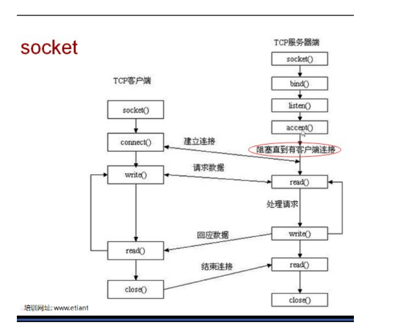

# Socket

本需求用于监听进程，用于进程的CPU，MEM等监听内容。

需用到Socket，加密问题，监听进程。

如果采用封装的C++还考虑数据类型的转换。

[官方文档](https://docs.python.org/3/howto/sockets.html)

参考文献：

CSDN：https://www.cnblogs.com/wumingxiaoyao/p/7047658.html

socket阻塞来自于服务器端accept()后进程阻塞等待链接

