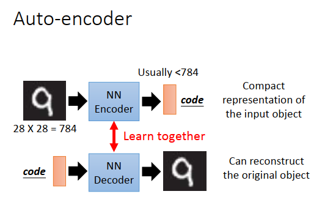
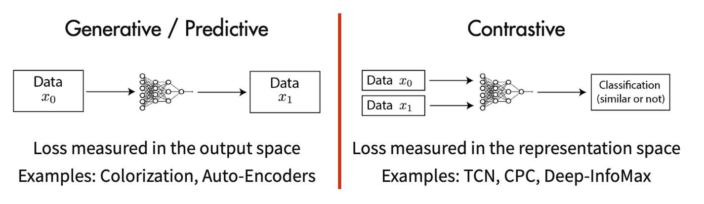
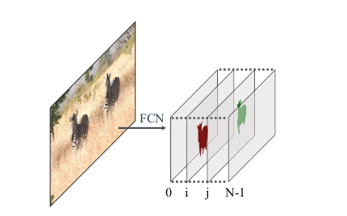
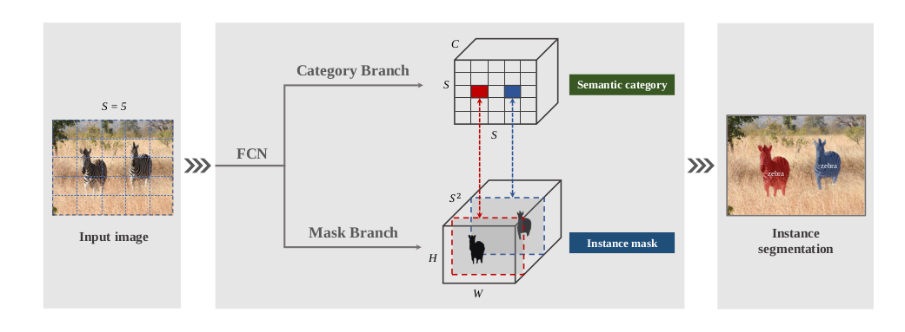
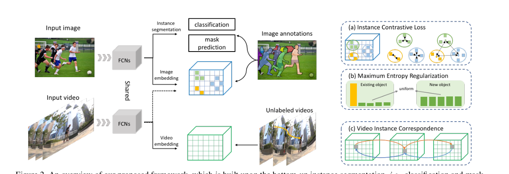
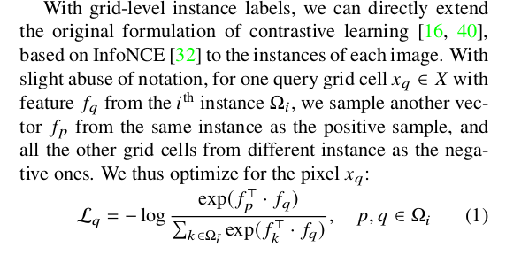
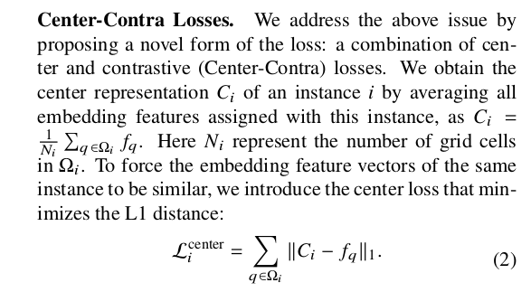
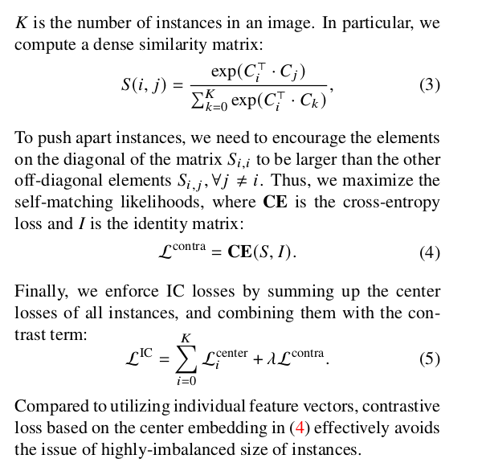
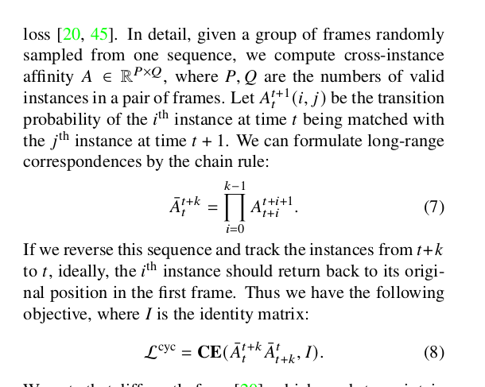

# Unsupervised Deep Tracking

**基础阅读：**

**Learning to Track instances without Video Annotations.**

该文章所阐述的内容主要为

1. 数据集：YouTube-VIS 为video instance segmentation ，PoseTrack 内容为人体实例，pose to track.
2. Self-Supervised Learning 自监督，无监督学习
3. 底层网络：SOLO Segmenting Objects by Locations 一种Instance segmentation（实例分割网络）的拓展特征层使用

数据集内容的话，不做较多阐述。

主要阐述内容为以下内容：

## What's the Self-supervised Learning

定义：机器学习中，主要分为，监督学习，非监督学习和强化学习。

- 监督学习，较为好理解，我们现在使用带标注文件，都为有监督学习，利用已知条件去做预测和学习，利用Backbone和Loss做与真值的差值，将其最后做链式法则做梯度传播去预测即为监督学习

- 非监督学习，就是不利用已知标注，直接得出结果，而较为常见的传统算法为聚类，直接获得分类结果。

  神经网络中，则采用Self-supervised Learning 即自监督学习，从名词上理解来说，也较为好理解，就是自己监督自己。何为自己监督自己，**主要希望是采用有一种通用的学习特征的表达方式用于表达下游任务**。常见的例子即为，假设一句话，中间少了个字，可通过上下文，进行预测中间所缺失的文字，或者图片缺失的补全。

  常见自监督的方式为：1.Generative Methods 2.Contrastive Methods。

  - **Generative Methods** 

    很常见的一种方式，即生成。何为生成即利用pixel，单个像素之间的差值进行重建。

    如下图编码解码的过程，何为该网络的优秀，即在一张原图进入该Encoder过程中，能通过Decoder返回一张近乎和原图一样的内容，代表该网络的

编码和解码

这种方式的自监督，为采用Pixel级别的Loss，形成Pixel级别的重建，为刚刚阐述的内容，很明显该方式在重建的过程损耗是极大的。

那衍生物会有一个GAN网络。

GAN网络和Auto-encoder不同所在于，利用G net生成，然后再用D net进行判别，

流程在做训练的过程中，G生成D做判别，不断的通过D网络的迭代和测试集优化了D的判别效率和准确率，但是G网络不参与测试集，只是在训练过程中生成的网络丢入D网络中，进入最后会生成形成一个较为优秀的G网络。

- **Contrasive self-supervised learning**

  即该文章中所使用的方式，并不是要求对目标网络进行重建，而是能通过**特征**的层面上，进行区别和理解分辨。

  该类方法较为明显特点1. 在feature 上构建度量学习，类似reid当时所说的表征和度量的关系。2.该方式特征不变在同一张图上3.不需要像素级的重建。

介绍了如上所述内容，为何所需self-supervised learning

在目前深度学习，对于监督学习，我们希望用尽可能少量的标注样本，进行训练获得一个泛化性较好的模型，很明显数据获取较为容易，而标注的成本是非常昂贵的。那相应而生，就产生最好无监督学习过程，目前主流也更推崇Contrasive learning 的方式。

## SOLO:Segmenting Objects by Locations 

实例分割网络，SOLO network 该网络源于Byte Dance 字节跳动和澳大利亚的阿德莱德大学。

实例分割采用的方式

#### Top-down

自上而下的密集实例分割的开山鼻祖是DeepMask，它通过滑动窗口的方法，即先检测出目标的Bbox，在对该Box所在在每个空间区域上都预测一个mask proposal，进行mask分割。

既先检测 bbox，后在每个bbox中进行mask的分割，例如Mask R-CNN

#### Bottom-up

自下而上的密集实例分割方法的一般套路是，通过生成per-pixel的embedding特征，再使用聚类和图论等后处理方法对其进行分组归类，先分割出每一个像素，再进行归类。

Learning to Track instances without Video Annotations.该文中声称的SOLO网络为bottom-up ，**原文SOLO声称自己非该两类级别为采用Non-box free dirctly**

一种直接的方式。

SOLO采用的方式为如下形式

过程使用为

上图中SOLO将图片分割成SxS的cell box 分别丢入两个网络中，一个网络用来预测种类，一个网络用于实例分割。

Category branch 会生成SxSxC的输出，C为种类数，Mask分支为HxWxS**2的输出

文中所使用内容为将SxS的grid cell box 作为输入丢入两个结构网络中，最后由于输出的分类为SxSxC，其中SxS的block，会形成一个特征向量，认为每一个block都是属于一个独立的实例分割，利用此特性将其与Mask的输出作为结合，那产生结合的过程为，结合过程中如上图中Category分支中的(i,j)的像素块检测到一个类，由于在被分割SxS的每个grid box通过原图进行展开经过Mask分支后会产生，那么对应的Mask分支为第(i*s+j)个HxW张量。因为前文所述说关系为一一对应的。所以可以产生联系。

## **Learning to Track instances without Video Annotations.**

通过上述为基础讲述以下内容，该文中所使用的为SOLO为基础的实例分割网络并进行self supervoised 追踪的“网络”（拓展）。

目的也在于解决Large scale 样本集上的标注困难问题和繁琐的问题。

该文就是借鉴于一个实例分割网络，Contrastive learning，形成一个自监督的追踪网络。

在该文中，启用的是和原文中SOLO一模一样的网络，但是增加了

Image embedding 和Video embedding 但是网络使用是同一种网络。

对比SOLO网络FCN，原文使用相同网络

FCNs -> Fully convolutional Networks for Semantic Segmentation

SOLO 网络在顶端作为利用SxS的grid cell classfication和mask prediction 

除了上面两个head 该文中增加了第三个head，作为一个embedding network for tracking in parallel with them

FPN->Feature Pyramid Networks

利用和 classification head at each level in FPN 作为特征提取模块，对图像进行特征提取，只是在进入特征提取的过程中使用了

40 × 40 作为每一个grid cell box.

上述网络经过阐述完毕后，如何将两者网络进行结合的Loss采用如下形式。

有**Instance** **Contrastive Loss** 

利用的是40x40的grid cell box 提取，

Center-Contra Losses

根据上述的loss整合了单张图和实例分割的关系，但是还未做到自监督和要做到时序信息，如视频的前后帧的信息，则用到下列的整合。

最后利用上述的视频信息进行整合后，可达到时序信息前后帧的关系，A为一个PxQ的矩阵。