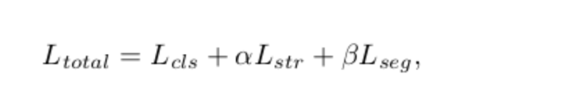

# Ultra-Fast-Lane-Detection
官方Code:
https://github.com/cfzd/Ultra-Fast-Lane-Detection

## 文章通读

文章中利用结构化整体Loss转化为整体分类问题，将原本的语义分割网络进行了加速，达到了300FPS+的inference速度，backbone(Resnet 18) + pool+cls构建组成。仅为inference速度，而定义网络结构参考来源于SCNN结构代码。

SCNN code:https://github.com/XingangPan/SCNN

### 代码解读：

#### model

从model/model.py中

```python
class parsingNet(torch.nn.Module):
	def __init__(self, size=(288, 800), pretrained=True, 
                backbone='50', cls_dim=(37, 10, 4), 
                use_aux=False):
                #通过backbone str关键字定义模型基础backbone网络
                #预训练模型
                #官方使用resnet18
    self.model = resnet(backbone, pretrained=pretrained)
    #如果没有使用use_aux则直接提取resnet骨干中间层
    #来自文件夹下./model/backbone.py
    # 从forward中
    # 提取为
    # input (1,3,288,800)
    # return x2,x3,x4 对应如下输出
    # out[0] torch.Size([1, 128, 36, 100])
	# out[1] torch.Size([1, 256, 18, 50])
	# out[2] torch.Size([1, 512, 9, 25])   ->> pool 512channals to 8 channals 
	# 最后直接池化 512chan->8channels
	# 8*9*25-->1800 直接接全连接层
 	fea = self.pool(fea).view(-1, 1800)
	# this full linear 1800-> 2048 Relu -> np.prob(cls_dim)
    group_cls = self.cls(fea).view(-1, *self.cls_dim)
	# 接分类转后如下形式 cls_dim层级结构
	# 走分类softmax之前会将第二维度重新倒叙排序，为方便映射
	# cls_dim 分级结构为 101 56 4 -> 前100层进行分类对应softmax求解
```

#### demo

从./demo.py 关注代码

如下为重要后处理代码，需跟loss有相关

```python
#关键 还有跨越框机制 类似anchor其实是为了方便标号映射到图网络空间
#对应为h -> 288 -> 56层 index 重新映射
cls_dim=(101,56,4)
#应分割块，w,h,line线个数
#前处理较为简单 转RGB通道归一化转tensor输入形式为4维向量需要batch带入
out = net(imgs)
#网络推理inference 直接出来的结果为[bs,c,h,w]
#际上对应的为 batchsize w h cls_num   --> cls_num 对应 车道线个数由标注数据集为4线主要目的应用场景为AutoDrving场景，所以需求非多线形式，自己部署仍需更改部分网络结构
#后处理开始部分
col_sample = np.linspace(0, 800 - 1, griding_num)
col_sample_w = col_sample[1] - col_sample[0]


out_j = out[0].data.cpu().numpy()
out_j = out_j[:, ::-1, :] # 倒序排序 为了方便h映射
prob = scipy.special.softmax(out_j[:-1, :, :], axis=0)# softmax归类分类，求极大值其实直接max序号索引也是可以
idx = np.arange(griding_num) + 1 #用于w映射
idx = idx.reshape(-1, 1, 1) #对应相乘 100*1*1 与100*56*4
loc = np.sum(prob * idx, axis=0)# 经过相乘对应求和 56*4
out_j = np.argmax(out_j, axis=0)直接求取out_j中最大值的索引axis=0方向--->会回归成w位置
loc[out_j == griding_num] = 0 #防止特殊异常值
out_j = loc#56*4
#out_j index of the max 
# import pdb; pdb.set_trace()
# vis = cv2.imread(args.test_path)
#映射部分 映射回w,h部分
#out_j
for i in range(out_j.shape[1]):#shape[1]->4 
if np.sum(out_j[:, i] != 0) > 2: 
    for k in range(out_j.shape[0]): # 0-3 单线开始遍历 总共4条线
        if out_j[k, i] > 0:
            ppp = (int(out_j[k, i] * col_sample_w * img_w / 800) - 1, int(img_h * (row_anchor[cls_num_per_lane-1-k]/288)) - 1 )
            cv2.circle(frame,ppp,5,(0,255,0),-1)
```

#### 测试样例

可直接测试demo.py，可用于测试视频，图片的形式，其实可以根据demo代码直接推出所需inference的数据结构

```python
import torch,cv2
import os, argparse
from model.model import parsingNet
from utils.common import merge_config
from utils.dist_utils import dist_print

import scipy.special, tqdm
import numpy as np
import torchvision.transforms as transforms
from data.dataset import LaneTestDataset
from data.constant import culane_row_anchor, tusimple_row_anchor

from PIL import Image

import pdb
from data.mytransforms import find_start_pos

def get_args():
    parser = argparse.ArgumentParser()
    # parser.add_argument('config', help = 'path to config file')
    parser.add_argument('--method',help='method of use the model video or img',type=str, default="img")
    parser.add_argument('--model_path ', default = None, type = str)
    parser.add_argument('--test_path', default = None, type = str)
    parser.add_argument('--num_lanes', default = None, type = int)
    # parser.add_argument('--auto_backup', action='store_true', help='automatically backup current code in the log path')
    return parser
if __name__ == "__main__":
    # this model set the use RGB type to predict
    torch.backends.cudnn.benchmark = True
    args = get_args().parse_args()
    img_transforms = transforms.Compose([
        transforms.Resize((288, 800)),
        transforms.ToTensor(),
        transforms.Normalize((0.485, 0.456, 0.406), (0.229, 0.224, 0.225)),
    ])
    # custom method paraments
    backbone="18"
    griding_num=100
    cls_num_per_lane = 56
    test_model = "./weights/tusimple_18.pth"
    img_w, img_h = 1920, 1080

    tusimple_row_anchor = [ 64,  68,  72,  76,  80,  84,  88,  92,  96, 100, 104, 108, 112,
            116, 120, 124, 128, 132, 136, 140, 144, 148, 152, 156, 160, 164,
            168, 172, 176, 180, 184, 188, 192, 196, 200, 204, 208, 212, 216,
            220, 224, 228, 232, 236, 240, 244, 248, 252, 256, 260, 264, 268,
            272, 276, 280, 284]

    row_anchor=tusimple_row_anchor
    net = parsingNet(pretrained = False, backbone=backbone,cls_dim = (griding_num+1,cls_num_per_lane,4),
                    use_aux=False).cuda() # we dont need auxiliary segmentation in testing

    state_dict = torch.load(test_model, map_location='cpu')['model']
    compatible_state_dict = {}
    for k, v in state_dict.items():
        if 'module.' in k:
            compatible_state_dict[k[7:]] = v
        else:
            compatible_state_dict[k] = v

    net.load_state_dict(compatible_state_dict, strict=False)
    net.eval()
    print(net)
    if(img_transforms is not None):
        print("there was fine in transPort")
    if(args.method =="img"):
        plImg = Image.open(args.test_path)
        # plImg = plImg.crop(0,540,1920,1080)
        img = img_transforms(plImg)
        
        img = torch.unsqueeze(img, dim=0)
        print(img.shape)
        imgs = img.cuda()
        with torch.no_grad():
            out = net(imgs)
        #[bs,griding_num+1,cls_num_per_lane,4]

        col_sample = np.linspace(0, 800 - 1, griding_num)
        col_sample_w = col_sample[1] - col_sample[0]


        out_j = out[0].data.cpu().numpy()
       # return (bs,cls_dim) cls_dim = (griding_num+1,cls_num_per_lane,4),
        out_j = out_j[:, ::-1, :]
        
        prob = scipy.special.softmax(out_j[:-1, :, :], axis=0)
        # [101,54,4] -> softmax[[[0.1,2],[0.2,3],[1,2]],[[2,3],[3,4],[0,0]]]---> parall softmax 
        idx = np.arange(griding_num) + 1
        idx = idx.reshape(-1, 1, 1)
        # prob*idx ---> 100*56*4  ---> sum axis 0 --->56*4
        loc = np.sum(prob * idx, axis=0)
        
        out_j = np.argmax(out_j, axis=0) #--->101channels max out_j index 
        loc[out_j == griding_num] = 0

        out_j = loc # 56*4

        # import pdb; pdb.set_trace()
        vis = cv2.imread(args.test_path)

        for i in range(out_j.shape[1]):
            if np.sum(out_j[:, i] != 0) > 2:
                for k in range(out_j.shape[0]):
                    if out_j[k, i] > 0:
                        ppp = (int(out_j[k, i] * col_sample_w * img_w / 800) - 1, int(img_h * (row_anchor[cls_num_per_lane-1-k]/288)) - 1 )
                        cv2.circle(vis,ppp,5,(0,255,0),-1)
        cv2.imwrite("res2.jpg",vis)
        # cv2.imshow("1",vis)
        # cv2.waitKey()
        # cv2.destroyAllWindows()
        # print("f")
    if(args.method =="video"):
        cap = cv2.VideoCapture(args.test_path)
        while(cap.isOpened()):
            ret,frame = cap.read()
            vis = frame# numpy.narray
            # img_RGB = cv2.cvtColor(frame, cv2.COLOR_BGR2RGB)
            img_RGB = Image.fromarray(cv2.cvtColor(frame,cv2.COLOR_BGR2RGB))  
            # img_RGB = img_RGB.crop((0,200,1920,1080))
            img = img_transforms(img_RGB)
            img = torch.unsqueeze(img, dim=0)
        # print(img.shape)
            imgs = img.cuda()
            with torch.no_grad():
                out = net(imgs)

            col_sample = np.linspace(0, 800 - 1, griding_num)
            col_sample_w = col_sample[1] - col_sample[0]


            out_j = out[0].data.cpu().numpy()
            out_j = out_j[:, ::-1, :]
            prob = scipy.special.softmax(out_j[:-1, :, :], axis=0)
            idx = np.arange(griding_num) + 1
            idx = idx.reshape(-1, 1, 1)
            loc = np.sum(prob * idx, axis=0)
            out_j = np.argmax(out_j, axis=0)
            loc[out_j == griding_num] = 0
            out_j = loc
#out_j index of the max 
            # import pdb; pdb.set_trace()
            # vis = cv2.imread(args.test_path)
            
            for i in range(out_j.shape[1]):
                if np.sum(out_j[:, i] != 0) > 2:
                    for k in range(out_j.shape[0]):
                        if out_j[k, i] > 0:
                            ppp = (int(out_j[k, i] * col_sample_w * img_w / 800) - 1, int(img_h * (row_anchor[cls_num_per_lane-1-k]/288)) - 1 )
                            cv2.circle(frame,ppp,5,(0,255,0),-1)
            # cv2.imwrite("res.jpg",frame)
            cv2.imshow("1",frame)
            cv2.waitKey(1)
        cv2.destroyAllWindows()
```

#### loss损失

loss相关的方向为:

Train中过程中为use_aux为开启

将会有两个输出为了拟合和帮助拟合分类求解的Lane Detection用于补偿

参考论文loss 3部分组成



```python
        if self.use_aux:            
            x2 = self.aux_header2(x2)
            x3 = self.aux_header3(x3)
            x3 = torch.nn.functional.interpolate(x3,scale_factor = 2,mode='bilinear')
            x4 = self.aux_header4(fea)
            x4 = torch.nn.functional.interpolate(x4,scale_factor = 4,mode='bilinear')
            aux_seg = torch.cat([x2,x3,x4],dim=1)
            aux_seg = self.aux_combine(aux_seg)
            #该网络用了 大网络conv配bn配relu 总共14层卷积配合上采样2层 将图像放大为原图 用于求loss参数在train.py inference函数中  
            # cls_out, seg_out = net(img)
            # 传参       
            # data_src = loss_dict['data_src'][i]

            # datas = [results[src] for src in data_src]

            # loss_cur = loss_dict['op'][i](*datas)
            # 使用loss定义在factory.py中
            # 'op': [SoftmaxFocalLoss(2), ParsingRelationLoss(), torch.nn.CrossEntropyLoss(), ParsingRelationDis()],
            # loss权重文件配置在config中
            
```

#### Train

Train.py由于model部分新加了aux部分其余网络部分为上述inference的过程部分

大致逻辑如上loss 去Train

接下来是Dataloader部分，train代码构建的方式如下

```python
if cfg.dataset == 'CULane':
    splits = ['test0_normal.txt', 'test1_crowd.txt', 'test2_hlight.txt', 'test3_shadow.txt', 'test4_noline.txt', 'test5_arrow.txt', 'test6_curve.txt', 'test7_cross.txt', 'test8_night.txt']
    datasets = [LaneTestDataset(cfg.data_root,os.path.join(cfg.data_root, 'list/test_split/'+split),img_transform = img_transforms) for split in splits]
    img_w, img_h = 1640, 590
    row_anchor = culane_row_anchor
elif cfg.dataset == 'Tusimple':
    splits = ['test.txt']
    datasets = [LaneTestDataset(cfg.data_root,os.path.join(cfg.data_root, split),img_transform = img_transforms) for split in splits]
    img_w, img_h = 1280, 720
    row_anchor = tusimple_row_anchor
```

#### 数据集

从源码中找寻该数据读取类

由于所需要一个语义分割(分类图关联)，datasets图其实中间要转换为语义分割

根据数据格式，官方demo提供两类数据读取也是AutoDriveDatasets

CULane官方数据格式，官方给的数据:

https://xingangpan.github.io/projects/CULane.html

仅仅分析下列数据集

Tusimple数据集:

https://github.com/TuSimple/tusimple-benchmark/issues/3

看标注格式如Json样例,包含了如下形式大致内容为以h为sample为y基础basic坐标的index对应4条标注线，每条标注线如果遇到-2则为非其余值为line的x轴坐标，构建了标注直线的模型。

```json
{"lanes": [[-2, -2, -2, -2, -2, -2, -2, -2, -2, 646, 637, 628, 620, 611, 602, 593, 585, 576, 567, 559, 550, 541, 533, 524, 515, 507, 498, 489, 481, 472, 463, 454, 446, 437, 428, 420, 411, 402, 394, 385, 376, 368, 359, 350, 342, 333, 324, 315, 307, 298, 289, 281, 272, 263, 255, 246], [-2, -2, -2, -2, -2, -2, -2, -2, -2, -2, 672, 686, 700, 714, 728, 742, 756, 770, 784, 798, 812, 826, 840, 854, 868, 882, 896, 910, 924, 938, 952, 966, 980, 994, 1008, 1022, 1036, 1050, 1064, 1078, 1092, 1106, 1120, 1134, 1148, 1162, 1176, 1190, 1204, 1218, 1232, 1246, 1260, -2, -2, -2], [-2, -2, -2, -2, -2, -2, -2, -2, -2, -2, 692, 728, 764, 799, 835, 871, 907, 943, 978, 1014, 1050, 1086, 1121, 1157, 1193, 1229, 1264, -2, -2, -2, -2, -2, -2, -2, -2, -2, -2, -2, -2, -2, -2, -2, -2, -2, -2, -2, -2, -2, -2, -2, -2, -2, -2, -2, -2, -2], [-2, -2, -2, -2, -2, -2, -2, -2, -2, -2, 742, 796, 849, 903, 956, 1010, 1063, 1117, 1171, 1224, -2, -2, -2, -2, -2, -2, -2, -2, -2, -2, -2, -2, -2, -2, -2, -2, -2, -2, -2, -2, -2, -2, -2, -2, -2, -2, -2, -2, -2, -2, -2, -2, -2, -2, -2, -2]], "h_samples": [160, 170, 180, 190, 200, 210, 220, 230, 240, 250, 260, 270, 280, 290, 300, 310, 320, 330, 340, 350, 360, 370, 380, 390, 400, 410, 420, 430, 440, 450, 460, 470, 480, 490, 500, 510, 520, 530, 540, 550, 560, 570, 580, 590, 600, 610, 620, 630, 640, 650, 660, 670, 680, 690, 700, 710], "raw_file": "clips/0530/1492626838739876007_0/20.jpg"}
```

datasets.py中

```python
class LaneClsDataset(torch.utils.data.Dataset):#一个数据类
#生成标签和数据格式的方式
#with open(list_path, 'r') as f:通过读取list_path指向的路径每行
img_name = img_name[1:]
label_name = label_name[1:]
Image.open(path)#通过读取方式直接归并为数据
#中间利用迭代方法返回给作为一个类传入dataloader，以达到可以自动遍历和生成的过程
```

